# concurrency

```text
$ flowarrow run main.flow
jobs: 16
total score: 1632
peak score: 272
```

## Why this example matters

This is the smallest example dedicated to concurrency. It avoids timing,
thread identifiers, sleeps, and shared state; those would make the result
depend on scheduler behavior instead of the FlowArrow graph.

1. **Independent jobs.** `range_step(1, 17, 1)` creates sixteen job ids.
   `map score_job` applies the same pure node to every id. The backend can
   lower that region to worker threads because each element has no data
   dependency on any other element.

2. **Parallel fanout after the map.** The `scores` sequence feeds both
   `reduce add(identity: 0)` and `reduce max(identity: 0)`. Once `scores`
   exists, the total and peak reductions are independent graph branches.

3. **Deterministic join.** `render_summary` joins the two aggregate results
   into stable stdout. Running with one worker or many workers produces the
   same bytes.

## Things to inspect

Use the graph command to see the parallel regions:

```text
$ flowarrow graph main.flow
```

Use the native build output to inspect backend lowering. A pure `map` over
`score_job` emits a `fa_parallel_for(...)` call in

```mermaid
flowchart TD
  subgraph callable_main["program main"]
    main_value__24args_3a_20Args(["$args: Args"])
    main_input_input_a_281_2c_2017_2c_201_29(["input<br/>(1, 17, 1)"])
    main_call_range_step["range_step"]
    main_input_input_a_281_2c_2017_2c_201_29 -- "value" --> main_call_range_step
    main_value__24jobs(["$jobs"])
    main_call_range_step -- "binds" --> main_value__24jobs
    main_map_map_20score_job["map score_job"]
    main_value__24jobs -- "$jobs" --> main_map_map_20score_job
    main_value__24scores(["$scores"])
    main_map_map_20score_job -- "binds" --> main_value__24scores
    main_reduce_reduce_20add_aidentity_3a_200["reduce add<br/>identity: 0"]
    main_value__24scores -- "$scores" --> main_reduce_reduce_20add_aidentity_3a_200
    main_value__24total(["$total"])
    main_reduce_reduce_20add_aidentity_3a_200 -- "binds" --> main_value__24total
    main_reduce_reduce_20max_aidentity_3a_200["reduce max<br/>identity: 0"]
    main_value__24scores -- "$scores" --> main_reduce_reduce_20max_aidentity_3a_200
    main_value__24peak(["$peak"])
    main_reduce_reduce_20max_aidentity_3a_200 -- "binds" --> main_value__24peak
    main_input_input_a_28_24total_2c_20_24peak_29(["input<br/>($total, $peak)"])
    main_value__24total -- "item" --> main_input_input_a_28_24total_2c_20_24peak_29
    main_value__24peak -- "item" --> main_input_input_a_28_24total_2c_20_24peak_29
    main_call_render_summary["render_summary"]
    main_input_input_a_28_24total_2c_20_24peak_29 -- "value" --> main_call_render_summary
    main_value__24output(["$output"])
    main_call_render_summary -- "binds" --> main_value__24output
    main_call_write_stdout[["write_stdout"]]
    main_value__24output -- "$output" --> main_call_write_stdout
    main_value__24exit_code(["$exit_code"])
    main_call_write_stdout -- "binds" --> main_value__24exit_code
  end
  subgraph callable_score_job["node score_job"]
    score_job_value__24n_3a_20Int(["$n: Int"])
    score_job_input_input_a_28_24n_2c_20_24n_29(["input<br/>($n, $n)"])
    score_job_value__24n_3a_20Int -- "item" --> score_job_input_input_a_28_24n_2c_20_24n_29
    score_job_value__24n_3a_20Int -- "item" --> score_job_input_input_a_28_24n_2c_20_24n_29
    score_job_call_mul["mul"]
    score_job_input_input_a_28_24n_2c_20_24n_29 -- "value" --> score_job_call_mul
    score_job_value__24square(["$square"])
    score_job_call_mul -- "binds" --> score_job_value__24square
    score_job_input_input_a_28_24square_2c_20_24n_29(["input<br/>($square, $n)"])
    score_job_value__24square -- "item" --> score_job_input_input_a_28_24square_2c_20_24n_29
    score_job_value__24n_3a_20Int -- "item" --> score_job_input_input_a_28_24square_2c_20_24n_29
    score_job_call_add["add"]
    score_job_input_input_a_28_24square_2c_20_24n_29 -- "value" --> score_job_call_add
    score_job_value__24score(["$score"])
    score_job_call_add -- "binds" --> score_job_value__24score
  end
  subgraph callable_render_summary["node render_summary"]
    render_summary_value__24total_3a_20Int(["$total: Int"])
    render_summary_value__24peak_3a_20Int(["$peak: Int"])
    render_summary_call_format_int["format_int"]
    render_summary_value__24total_3a_20Int -- "$total" --> render_summary_call_format_int
    render_summary_value__24total_bytes(["$total_bytes"])
    render_summary_call_format_int -- "binds" --> render_summary_value__24total_bytes
    render_summary_call_format_int_2["format_int"]
    render_summary_value__24peak_3a_20Int -- "$peak" --> render_summary_call_format_int_2
    render_summary_value__24peak_bytes(["$peak_bytes"])
    render_summary_call_format_int_2 -- "binds" --> render_summary_value__24peak_bytes
    render_summary_input_input_a_5b_22jobs_3a_2016_5cn_22_2c_20_22total_20score_3a_20_22_2c_20_24tot(["input<br/>[&quot;jobs: 16\n&quot;, &quot;total score: &quot;, $total_bytes, &quot;\n&quot;, &quot;peak score: &quot;, $peak_bytes, &quot;\n&quot;]"])
    render_summary_value__24total_bytes -- "item" --> render_summary_input_input_a_5b_22jobs_3a_2016_5cn_22_2c_20_22total_20score_3a_20_22_2c_20_24tot
    render_summary_value__24peak_bytes -- "item" --> render_summary_input_input_a_5b_22jobs_3a_2016_5cn_22_2c_20_22total_20score_3a_20_22_2c_20_24tot
    render_summary_call_concat_bytes["concat_bytes"]
    render_summary_input_input_a_5b_22jobs_3a_2016_5cn_22_2c_20_22total_20score_3a_20_22_2c_20_24tot -- "value" --> render_summary_call_concat_bytes
    render_summary_value__24output(["$output"])
    render_summary_call_concat_bytes -- "binds" --> render_summary_value__24output
  end
  subgraph legend["legend"]
    legend_value_value_20_2f_20binding(["value / binding"])
    legend_op_pure_20operation["pure operation"]
    legend_boundary_boundary_20operation[["boundary operation"]]
    legend_collection_collection_20operator["collection operator"]
    legend_decision_match_20_2f_20decision{"match / decision"}
    legend_fault_fault_20path["fault path"]
  end
  classDef value fill:#e8f4ff,stroke:#2f6f9f,color:#102a43
  classDef literal fill:#f7f9fb,stroke:#9aa6b2,color:#1f2933
  classDef op fill:#ffffff,stroke:#59636e,color:#111827
  classDef boundary fill:#fff4df,stroke:#b87918,color:#3f2a05
  classDef collection fill:#ecfdf3,stroke:#2f855a,color:#123524
  classDef decision fill:#f4ecff,stroke:#7c3aed,color:#2d124d
  classDef fault fill:#ffecec,stroke:#c64242,color:#5a1111
  class main_value__24args_3a_20Args value
  class main_input_input_a_281_2c_2017_2c_201_29 literal
  class main_call_range_step op
  class main_value__24jobs value
  class main_map_map_20score_job collection
  class main_value__24scores value
  class main_reduce_reduce_20add_aidentity_3a_200 collection
  class main_value__24total value
  class main_reduce_reduce_20max_aidentity_3a_200 collection
  class main_value__24peak value
  class main_input_input_a_28_24total_2c_20_24peak_29 literal
  class main_call_render_summary op
  class main_value__24output value
  class main_call_write_stdout boundary
  class main_value__24exit_code value
  class score_job_value__24n_3a_20Int value
  class score_job_input_input_a_28_24n_2c_20_24n_29 literal
  class score_job_call_mul op
  class score_job_value__24square value
  class score_job_input_input_a_28_24square_2c_20_24n_29 literal
  class score_job_call_add op
  class score_job_value__24score value
  class render_summary_value__24total_3a_20Int value
  class render_summary_value__24peak_3a_20Int value
  class render_summary_call_format_int op
  class render_summary_value__24total_bytes value
  class render_summary_call_format_int_2 op
  class render_summary_value__24peak_bytes value
  class render_summary_input_input_a_5b_22jobs_3a_2016_5cn_22_2c_20_22total_20score_3a_20_22_2c_20_24tot literal
  class render_summary_call_concat_bytes op
  class render_summary_value__24output value
  class legend_value_value_20_2f_20binding value
  class legend_op_pure_20operation op
  class legend_boundary_boundary_20operation boundary
  class legend_collection_collection_20operator collection
  class legend_decision_match_20_2f_20decision decision
  class legend_fault_fault_20path fault
```

`build/<target>/.cache/runtime.c`.

